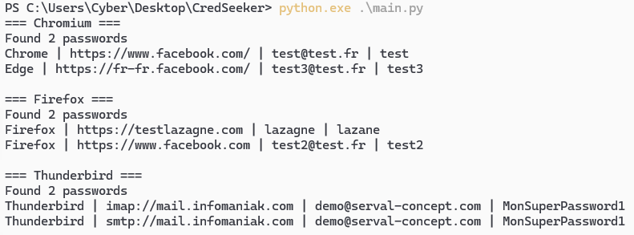

# CredSeeker

**CredSeeker** is a password and authentication information extraction tool for Windows. It allows users to recover credentials stored in web browsers and email clients.

## ⚠️ Legal Disclaimer

This tool is intended solely for educational purposes, security testing, and recovering your own passwords. Using this software on systems without explicit permission is illegal. The user is solely responsible for the usage of this tool.

## 🚀 Features

CredSeeker extracts passwords and credentials from the following sources:

- **Web Browsers**
  - Chrome
  - Microsoft Edge (Chromium-based)
  - Firefox

- **Email Clients**
  - Mozilla Thunderbird

## 🧪 Tested Versions

| Application    | Version | Status |
|----------------|---------|--------|
| Firefox        | 144.02  | ✅ Tested |
| Thunderbird    | 144.02  | ✅ Tested |
| Chrome         | 142     | ✅ Tested |
| Edge (Chromium)| 141     | ✅ Tested |

## 📋 Requirements

- **Windows 10/11**
- **Python 3.8+**
- **Administrator rights** (required for DPAPI access)
- **Python Dependencies:**
  - pywin32
  - PythonForWindows (for LSASS impersonation)
  - pycryptodome

## 🛠️ Installation

1. Clone the repository:
   ```bash
   git clone https://github.com/[votre-nom]/credseeker.git
   cd credseeker
   ```

2. Install the dependencies:
    ```bash
    pip install -r requirements.txt
    ```

## 🎯 Usage



## 🔧 Technical Details

### Decryption Methods
- **Chrome/Edge:**
  - Passwords: DPAPI + AES-GCM (v10/v20)
- **Firefox/Thunderbird:**
  - NSS (Network Security Services)
  - Decrypting `logins.json` and `key4.db` files

---

## Security
- Utilizes **LSASS** impersonation to access system keys.
- **DPAPI** (Data Protection API) Windows decryption.
- Manages **SeDebugPrivilege** rights.

---

## 🚨 Known Limitations
- Requires administrator rights.
- Works only on Windows.
- Cannot decrypt Firefox profiles protected by a master password.
- Modern OAuth2 tokens may not be recoverable.

---

## 🔗 Resources
- [DPAPI Documentation](https://docs.microsoft.com/en-us/windows/win32/api/dpapi/)
- [Chrome Password Storage](https://chromium.googlesource.com/chromium/src/+/main/components/os_crypt/)
- [Firefox Password Storage](https://firefox-source-docs.mozilla.org/security/nss/index.html)

